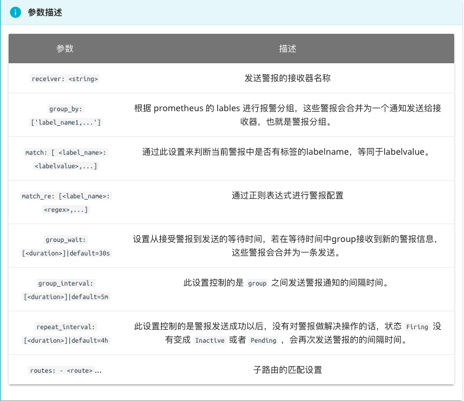

# Alertmanager配置概述

在上面的部分中已经简单介绍过，在Alertmanager中通过路由(Route)来定义告警的处理方式。路由是一个基于标签匹配的树状匹配结构。根据接收到告警的标签匹配相应的处理方式。这里将详细介绍路由相关的内容。

Alertmanager主要负责对Prometheus产生的告警进行统一处理，因此在Alertmanager配置中一般会包含以下几个主要部分：

* 全局配置（global）：用于定义一些全局的公共参数，如全局的SMTP配置，Slack配置等内容；
* 模板（templates）：用于定义告警通知时的模板，如HTML模板，邮件模板等；
* 告警路由（route）：根据标签匹配，确定当前告警应该如何处理；
* 接收人（receivers）：接收人是一个抽象的概念，它可以是一个邮箱也可以是微信，Slack或者Webhook等，接收人一般配合告警路由使用；
* 抑制规则（inhibit_rules）：合理设置抑制规则可以减少垃圾告警的产生

其完整配置格式如下：

```
global:
  [ resolve_timeout: <duration> | default = 5m ]
  [ smtp_from: <tmpl_string> ] 
  [ smtp_smarthost: <string> ] 
  [ smtp_hello: <string> | default = "localhost" ]
  [ smtp_auth_username: <string> ]
  [ smtp_auth_password: <secret> ]
  [ smtp_auth_identity: <string> ]
  [ smtp_auth_secret: <secret> ]
  [ smtp_require_tls: <bool> | default = true ]
  [ slack_api_url: <secret> ]
  [ victorops_api_key: <secret> ]
  [ victorops_api_url: <string> | default = "https://alert.victorops.com/integrations/generic/20131114/alert/" ]
  [ pagerduty_url: <string> | default = "https://events.pagerduty.com/v2/enqueue" ]
  [ opsgenie_api_key: <secret> ]
  [ opsgenie_api_url: <string> | default = "https://api.opsgenie.com/" ]
  [ hipchat_api_url: <string> | default = "https://api.hipchat.com/" ]
  [ hipchat_auth_token: <secret> ]
  [ wechat_api_url: <string> | default = "https://qyapi.weixin.qq.com/cgi-bin/" ]
  [ wechat_api_secret: <secret> ]
  [ wechat_api_corp_id: <string> ]
  [ http_config: <http_config> ]

templates:
  [ - <filepath> ... ]

route: <route>

receivers:
  - <receiver> ...

inhibit_rules:
  [ - <inhibit_rule> ... ]
```

在全局配置中需要注意的是`resolve_timeout`，该参数定义了当Alertmanager持续多长时间未接收到告警后标记告警状态为resolved（已解决）。该参数的定义可能会影响到告警恢复通知的接收时间，读者可根据自己的实际场景进行定义，其默认值为5分钟。在接下来的部分，我们将已一些实际的例子解释Alertmanager的其它配置内容。

# Alertmanager配置详解

Alertmanager一个完整的配置文件范例：
```yaml
## Alertmanager 配置文件
global:
  resolve_timeout: 5m
  # smtp配置
  smtp_from: "prom-alert@example.com"
  smtp_smarthost: 'email-smtp.us-west-2.amazonaws.com:465'
  smtp_auth_username: "user"
  smtp_auth_password: "pass"
  smtp_require_tls: true
# email、企业微信的模板配置存放位置，钉钉的模板会单独讲如果配置。
templates:
  - '/data/alertmanager/templates/*.tmpl'
# 路由分组
route:
  receiver: ops
  group_wait: 30s # 在组内等待所配置的时间，如果同组内，30秒内出现相同报警，在一个组内出现。
  group_interval: 5m # 如果组内内容不变化，合并为一条警报信息，5m后发送。
  repeat_interval: 24h # 发送报警间隔，如果指定时间内没有修复，则重新发送报警。
  group_by: [alertname]  # 报警分组，按照告警带的label-value来分组
  routes:
      - match:
          team: operations
        group_by: [env,dc]
        receiver: 'ops'
      - match_re:
          service: nginx|apache
        receiver: 'web'
      - match_re:
          service: hbase|spark
        receiver: 'hadoop'
      - match_re:
          service: mysql|mongodb
        receiver: 'db'
# 接收器
# 抑制测试配置
      - receiver: ops
        group_wait: 10s
        match:
          status: 'High'
# ops
      - receiver: ops # 路由和标签，根据match来指定发送目标，如果 rule的lable 包含 alertname， 使用 ops 来发送
        group_wait: 10s
        match:
          team: operations
# web
      - receiver: db # 路由和标签，根据match来指定发送目标，如果 rule的lable 包含 alertname， 使用 db 来发送
        group_wait: 10s
        match:
          team: db
# 接收器指定发送人以及发送渠道
receivers:
# ops分组的定义
- name: ops
  email_configs:
  - to: '9935226@qq.com,10000@qq.com'
    send_resolved: true
    headers: 
      subject: "[operations] 报警邮件"
      from: "警报中心"
      to: "小煜狼皇" 
  # 钉钉配置
  webhook_configs:
  - url: http://localhost:8070/dingtalk/ops/send
    # 企业微信配置
  wechat_configs:
  - corp_id: 'ww5421dksajhdasjkhj'
    api_url: 'https://qyapi.weixin.qq.com/cgi-bin/'
    send_resolved: true
    to_party: '2'
    agent_id: '1000002'
    api_secret: 'Tm1kkEE3RGqVhv5hO-khdakjsdkjsahjkdksahjkdsahkj'

# web
- name: web
  email_configs:
  - to: '9935226@qq.com'
    send_resolved: true
    headers: { Subject: "[web] 报警邮件"} # 接收邮件的标题
  webhook_configs:
  - url: http://localhost:8070/dingtalk/web/send
  - url: http://localhost:8070/dingtalk/ops/send
# db
- name: db
  email_configs:
  - to: '9935226@qq.com'
    send_resolved: true
    headers: { Subject: "[db] 报警邮件"} # 接收邮件的标题
  webhook_configs:
  - url: http://localhost:8070/dingtalk/db/send
  - url: http://localhost:8070/dingtalk/ops/send
# hadoop
- name: hadoop
  email_configs:
  - to: '9935226@qq.com'
    send_resolved: true
    headers: { Subject: "[hadoop] 报警邮件"} # 接收邮件的标题
  webhook_configs:
  - url: http://localhost:8070/dingtalk/hadoop/send
  - url: http://localhost:8070/dingtalk/ops/send

# 抑制器配置
inhibit_rules: # 抑制规则
  - source_match: # 源标签警报触发时抑制含有目标标签的警报，在当前警报匹配 status: 'High'
      status: 'High'  # 此处的抑制匹配一定在最上面的route中配置不然，会提示找不key。
    target_match:
      status: 'Warning' # 目标标签值正则匹配，可以是正则表达式如: ".*MySQL.*"
    equal: ['alertname','operations', 'instance'] # 确保这个配置下的标签内容相同才会抑制，也就是说警报中必须有这三个标签值才会被抑制。
```
## global
即为全局设置，在 Alertmanager 配置文件中，只要全局设置配置了的选项，全部为公共设置，可以让其他设置继承，作为默认值，可以子参数中覆盖其设置。其中 resolve_timeout 用于设置处理超时时间，也是生命警报状态为解决的时间， 这个时间会直接影响到警报恢复的通知时间，需要自行结合实际生产场景来设置主机的恢复时间，默认是5分钟。在全局设置中可以设置smtp服务，同时也支持slack、victorops、pagerduty等，在这里只讲我们常用的Email，钉钉，企业微信， 同时也可以自己使用go语言开发的gubot进行二次开发，对接自定义webhook通知源。

## template
警报模板可以自定义通知的信息格式，以及其包含的对应警报指标数据，可以自定义Email、企业微信的模板，配置指定的存放位置，对于钉钉的模板会单独讲如何配置，这里的模板是指的发送的通知源信息格式模板，比如Email，企业微信。

## route
警报路由模块描述了在收到 Prometheus 生成的警报后，将警报信息发送给接收器 receiver 指定的目标地址规则。 Alertmanager 对传入的警报信息进行处理，根据所定义的规则与配置进行匹配。对于路由可以理解为树状结构， 设置的第一个route是根节点，往下的就是包含的子节点，每个警报传进来以后，会从配置的根节点路由进入路由树，按照深度优先从左向右遍历匹配，直到找到最深的匹配route，并将告警发送到该route定义的receiver中。但如果route中设置continue的值为false，那么告警在匹配到第一个子节点之后就直接停止。如果continue为true，报警则会继续进行后续子节点的匹配。如果当前告警匹配不到任何的子节点，那该告警将会基于当前路由的根节点的接收器配置方式进行处理。


## receiver
接受器是一个统称，每个 receiver 都有需要设置一个全局唯一的名称，并且对应一个或者多个通知方式，包括email、微信、Slack、钉钉等。

## inhibit_rules
inhibit_rules 模块中设置警报抑制功能，可以指定在特定条件下需要忽略的警报条件。可以使用此选项设置首选，比如优先处理某些警报，如果同一组中的警报同时发生，则忽略其他警报。 合理使用 inhibit_rules ，可以减少频发发送没有意义的警报的产生。