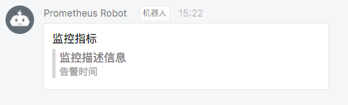
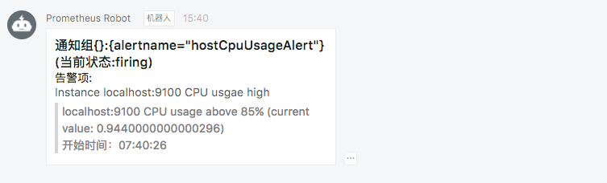

# 使用Webhook扩展Alertmanager

在某些情况下除了Alertmanager已经内置的集中告警通知方式以外，对于不同的用户和组织而言还需要一些自定义的告知方式支持。通过Alertmanager提供的webhook支持可以轻松实现这一类的扩展。除了用于支持额外的通知方式，webhook还可以与其他第三方系统集成实现运维自动化，或者弹性伸缩等。

在Alertmanager中可以使用如下配置定义基于webhook的告警接收器receiver。一个receiver可以对应一组webhook配置。

```yaml
name: <string>
webhook_configs:
  [ - <webhook_config>, ... ]
```

每一项webhook_config的具体配置格式如下：

```yaml
# Whether or not to notify about resolved alerts.
[ send_resolved: <boolean> | default = true ]

# The endpoint to send HTTP POST requests to.
url: <string>

# The HTTP client's configuration.
[ http_config: <http_config> | default = global.http_config ]
```

send_resolved用于指定是否在告警消除时发送回执消息。url则是用于接收webhook请求的地址。http_configs则是在需要对请求进行SSL配置时使用。

当用户定义webhook用于接收告警信息后，当告警被触发时，Alertmanager会按照以下格式向这些url地址发送HTTP Post请求，请求内容如下：

```json
{
  "version": "4",
  "groupKey": <string>,    // key identifying the group of alerts (e.g. to deduplicate)
  "status": "<resolved|firing>",
  "receiver": <string>,
  "groupLabels": <object>,
  "commonLabels": <object>,
  "commonAnnotations": <object>,
  "externalURL": <string>,  // backlink to the Alertmanager.
  "alerts": [
    {
      "labels": <object>,
      "annotations": <object>,
      "startsAt": "<rfc3339>",
      "endsAt": "<rfc3339>"
    }
  ]
}
```

### 使用Golang创建webhook服务

首先我们尝试使用Golang创建用于接收webhook告警通知的服务。首先创建model包，用于映射ALertmanager发送的告警信息，Alertmanager的一个通知中根据配置的group_by规则可能会包含多条告警信息Alert。创建告警通知对应的结构体Notification。

```golang
package model

import "time"

type Alert struct {
	Labels      map[string]string `json:"labels"`
	Annotations map[string]string `json:annotations`
	StartsAt    time.Time         `json:"startsAt"`
	EndsAt      time.Time         `json:"endsAt"`
}

type Notification struct {
	Version           string            `json:"version"`
	GroupKey          string            `json:"groupKey"`
	Status            string            `json:"status"`
	Receiver          string            `json:receiver`
	GroupLabels       map[string]string `json:groupLabels`
	CommonLabels      map[string]string `json:commonLabels`
	CommonAnnotations map[string]string `json:commonAnnotations`
	ExternalURL       string            `json:externalURL`
	Alerts            []Alert           `json:alerts`
}
```

这里使用gin-gonic框架创建用于接收Webhook通知的Web服务。定义路由/webhook接收来自Alertmanager的POST请求。

```golang
package main

import (
	"net/http"

	"github.com/gin-gonic/gin"
	model "github.com/yunlzheng/alertmanaer-dingtalk-webhook/model"
)

func main() {
	router := gin.Default()
	router.POST("/webhook", func(c *gin.Context) {
		var notification model.Notification

		err := c.BindJSON(&notification)

		if err != nil {
			c.JSON(http.StatusBadRequest, gin.H{"error": err.Error()})
			return
		}

		c.JSON(http.StatusOK, gin.H{"message": " successful receive alert notification message!"})

	})
	router.Run()
}
```

### 与钉钉集成

钉钉，阿里巴巴出品，专为中国企业打造的免费智能移动办公平台，提供了即时通讯以及移动办公等丰富的功能。

[钉钉群机器人](https://open-doc.dingtalk.com/docs/doc.htm?spm=a219a.7629140.0.0.8M9OKD&treeId=257&articleId=105733&docType=1)是钉钉群的高级扩展功能。群机器人可以将第三方服务的信息聚合到群聊中，实现自动化的信息同步。例如：通过聚合GitHub，GitLab等源码管理服务，实现源码更新同步；通过聚合Trello，JIRA等项目协调服务，实现项目信息同步。不仅如此，群机器人支持Webhook协议的自定义接入，支持更多可能性。这里我们将演示如果将Alertmanager运维报警提醒通过自定义机器人聚合到钉钉群。

这里将继续扩展webhook服务，以支持将Alertmanager的告警通知转发到钉钉平台。完整的示例代码可以从github仓库[https://github.com/yunlzheng/alertmanaer-dingtalk-webhook](https://github.com/yunlzheng/alertmanaer-dingtalk-webhook)中获取。

##### 自定义webhook群机器人

通过钉钉客户端（如：桌面或者手机）进入到群设置后选择“群机器人”。将显示如下界面：


选择“自定义机器人”，并且按照提示填写机器人名称，获取机器人webhook地址，如下所示：


webhook机器人创建成功后，用户就可以使用任何方式向该地址发起HTTP POST请求，即可实现向该群主发送消息。目前自定义机器人支持文本(text)，连接(link)，markdown三种消息类型。

例如，可以向webhook地址以POST形式发送以下

```json
{
     "msgtype": "markdown",
     "markdown": {
         "title":"Prometheus告警信息",
         "text": "#### 监控指标\n" +
                 "> 监控描述信息\n\n" +
                 "> ###### 告警时间 \n"
     },
    "at": {
        "atMobiles": [
            "156xxxx8827",
            "189xxxx8325"
        ], 
        "isAtAll": false
    }
 }
```

可以使用curl验证钉钉webhook是否能够成功调用：

```
$ curl -l -H "Content-type: application/json" -X POST -d '{"msgtype": "markdown","markdown": {"title":"Prometheus告警信息","text": "#### 监控指标\n> 监控描述信息\n\n> ###### 告警时间 \n"},"at": {"isAtAll": false}}' https://oapi.dingtalk.com/robot/send?access_token=xxxx
{"errcode":0,"errmsg":"ok"}
```

调用成功后，可以在钉钉应用群消息中接收到类似于如下通知消息:



##### 定义转换器将告警通知转化为Dingtalk消息对象

这里定义结构体DingTalkMarkdown用于映射Dingtalk的消息体。

```golang
package model

type At struct {
	AtMobiles []string `json:"atMobiles"`
	IsAtAll   bool     `json:"isAtAll"`
}

type DingTalkMarkdown struct {
	MsgType  string    `json:"msgtype"`
	At       *At       `json:at`
	Markdown *Markdown `json:"markdown"`
}

type Markdown struct {
	Title string `json:"title"`
	Text  string `json:"text"`
}
```

定义转换器将Alertmanager发送的告警通知转换为Dingtalk的消息体。

```golang
package transformer

import (
	"bytes"
	"fmt"

	"github.com/yunlzheng/alertmanaer-dingtalk-webhook/model"
)

// TransformToMarkdown transform alertmanager notification to dingtalk markdow message
func TransformToMarkdown(notification model.Notification) (markdown *model.DingTalkMarkdown, err error) {

	groupKey := notification.GroupKey
	status := notification.Status

	annotations := notification.CommonAnnotations

	var buffer bytes.Buffer

	buffer.WriteString(fmt.Sprintf("### 通知组%s(当前状态:%s) \n", groupKey, status))

	buffer.WriteString(fmt.Sprintf("#### 告警项:\n"))

	for _, alert := range notification.Alerts {
		annotations := alert.Annotations
		buffer.WriteString(fmt.Sprintf("##### %s\n > %s\n", annotations["summary"], annotations["description"]))
		buffer.WriteString(fmt.Sprintf("\n> 开始时间：%s\n", alert.StartsAt.Format("15:04:05")))
	}

	markdown = &model.DingTalkMarkdown{
		MsgType: "markdown",
		Markdown: &model.Markdown{
			Title: fmt.Sprintf("通知组：%s(当前状态:%s)", groupKey, status),
			Text:  buffer.String(),
		},
		At: &model.At{
			IsAtAll: false,
		},
	}

	return
}
```

##### 创建Dingtalk通知发送包

notifier包中使用golang的net/http包实现与Dingtalk群机器人的交互。Send方法包含两个参数：接收到的告警通知结构体指针，以及Dingtalk群机器人的Webhook地址。

通过包transformer.TransformToMarkdown将Alertmanager告警通知与Dingtalk消息进行映射。


```golang
package notifier

import (
	"bytes"
	"encoding/json"
	"fmt"
	"net/http"

	"github.com/yunlzheng/alertmanaer-dingtalk-webhook/model"
	"github.com/yunlzheng/alertmanaer-dingtalk-webhook/transformer"
)

func Send(notification model.Notification, dingtalkRobot string) (err error) {

	markdown, err := transformer.TransformToMarkdown(notification)

	if err != nil {
		return
	}

	data, err := json.Marshal(markdown)
	if err != nil {
		return
	}

	req, err := http.NewRequest(
		"POST",
		dingtalkRobot,
		bytes.NewBuffer(data))

	if err != nil {
		return
	}

	req.Header.Set("Content-Type", "application/json")
	client := &http.Client{}
	resp, err := client.Do(req)

	if err != nil {
		return
	}

	defer resp.Body.Close()
	fmt.Println("response Status:", resp.Status)
	fmt.Println("response Headers:", resp.Header)

	return
}
```

##### 扩展启动函数

首先为程序添加命令行参数支持，用于在启动时添加全局的Dingtalk群聊机器人地址。

```golang
package main

import (
  "flag"
  ...
  "github.com/yunlzheng/alertmanaer-dingtalk-webhook/notifier"
)

var (
	h            bool
	defaultRobot string
)

func init() {
	flag.BoolVar(&h, "h", false, "help")
	flag.StringVar(&defaultRobot, "defaultRobot", "", "global dingtalk robot webhook")
}

func main() {

	flag.Parse()

	if h {
		flag.Usage()
		return
	}

  ...

}
```

同时通过notifier包的Send方法将告警通知发送给Dingtalk群聊机器人

```
func main() {

  ...

  err = notifier.Send(notification, defaultRobot)

  if err != nil {
    c.JSON(http.StatusBadRequest, gin.H{"error": err.Error()})

  }

  c.JSON(http.StatusOK, gin.H{"message": "send to dingtalk successful!"})
}
```

##### 使用Dingtalk扩展

运行并启动dingtalk webhook服务之后，修改Alertmanager配置文件, 为default-receiver添加webhook配置，如下所示：

```
receivers:
  - name: default-receiver
    email_configs:
      - to: yunl.zheng@wise2c.com
	webhook_configs:
	  - url: http://localhost:8080/webhook
```

重启Alertmanager服务后，手动拉高虚拟机CPU使用率触发告警条件，此时Dingtalk即可接收到相应的告警通知信息:




### 钉钉机器人(Webhook)
对于钉钉大家都已经很熟悉了，大部分企业都已经启用钉钉办公了，同时其推出的免费的webhook机器人也很受大家的欢迎。我们这里讲一下借助第三方开源组件如何对钉钉集成警报功能。

首先需要在钉钉创建机器人，然后在白名单中添加关键字信息与ip限制等安全设置，这个只要你有群，你就可以在群里面建，非常简单，这里就不做演示了

先把Prometheus-webhook-Dingtalk组件装好。
```bash
mkdir -p /etc/prometheus-webhook-dingtalk/template/
cd /etc/prometheus-webhook-dingtalk/
wget https://github.com/timonwong/prometheus-webhook-dingtalk/releases/download/v1.4.0/prometheus-webhook-dingtalk-1.4.0.linux-amd64.tar.gz
tar xf prometheus-webhook-dingtalk-1.4.0.linux-amd64.tar.gz
mv prometheus-webhook-dingtalk-1.4.0.linux-amd64/* /etc/prometheus-webhook-dingtalk/
mv prometheus-webhook-dingtalk /bin/
cat <<EOF> /lib/systemd/system/prometheus-webhook-dingtalk.service 
[Unit]
Description=prometheus-webhook-dingding
Documentation=https://prometheus.io/
After=network.target

[Service]
Type=simple
User=prometheus
ExecStart=/bin/prometheus-webhook-dingtalk --web.listen-address=":8070" --web.enable-ui --config.file="/etc/prometheus-webhook-dingtalk/config.yml"
Restart=on-failure

[Install]
WantedBy=multi-user.target
EOF
#启动服务
systemctl enable prometheus-webhook-dingtalk.service
systemctl start prometheus-webhook-dingtalk.service
```
配置文件
```yaml
## Request timeout
# timeout: 5s

## Customizable templates path
## Customizable templates path
templates:
        # - contrib/templates/legacy/template.tmpl
  # 自定义模板路径
  - /etc/prometheus-webhook-dingtalk/template/default.tmpl

## 你还可以使用' default_message '覆盖默认模板
## 下面的示例使用v0.3.0中的“legacy”模板
# default_message:
#   title: '{{ template "legacy.title" . }}'
#   text: '{{ template "legacy.content" . }}'

## Targets, previously was known as "profiles"
# 定义的webhook，钉钉创建的webhook token
targets:
# 如果有多个分组就可以在这里定义多个接口
  ops:
    url: https://oapi.dingtalk.com/robot/send?access_token=a4feed2322222222222222222222222
  web:
    url: https://oapi.dingtalk.com/robot/send?access_token=a4feed2325c1333333333333333333333
```
定义模板：

```bash
cd /etc/prometheus-webhook-dingtalk/template
cat default.tmpl
{{ define "__subject" }}[{{ .Status | toUpper }}{{ if eq .Status "firing" }}:{{ .Alerts.Firing | len }}{{ end }}] {{ .GroupLabels.SortedPairs.Values | join " " }} {{ if gt (len .CommonLabels) (len .GroupLabels) }}({{ with .CommonLabels.Remove .GroupLabels.Names }}{{ .Values | join " " }}{{ end }}){{ end }}{{ end }}
{{ define "__alertmanagerURL" }}{{ .ExternalURL }}/#/alerts?receiver={{ .Receiver }}{{ end }}

{{ define "__text_alert_list" }}{{ range . }}
**Labels**
{{ range .Labels.SortedPairs }}> - {{ .Name }}: {{ .Value | markdown | html }}
{{ end }}
**Annotations**
{{ range .Annotations.SortedPairs }}> - {{ .Name }}: {{ .Value | markdown | html }}
{{ end }}
**Source:** [{{ .GeneratorURL }}]({{ .GeneratorURL }})
{{ end }}{{ end }}

{{/* Firing */}}

{{ define "default.__text_alert_list" }}{{ range . }}

**Trigger Time:** {{ dateInZone "2006.01.02 15:04:05" (.StartsAt) "Asia/Shanghai" }}

**Summary:** {{ .Annotations.summary }}

**Description:** {{ .Annotations.description }}

**Graph:** [📈 ]({{ .GeneratorURL }})

**Details:**
{{ range .Labels.SortedPairs }}{{ if and (ne (.Name) "severity") (ne (.Name) "summary") }}> - {{ .Name }}: {{ .Value | markdown | html }}
{{ end }}{{ end }}
{{ end }}{{ end }}

{{/* Resolved */}}

{{ define "default.__text_resolved_list" }}{{ range . }}

**Trigger Time:** {{ dateInZone "2006.01.02 15:04:05" (.StartsAt) "Asia/Shanghai" }}

**Resolved Time:** {{ dateInZone "2006.01.02 15:04:05" (.EndsAt) "Asia/Shanghai" }}

**Summary:** {{ .Annotations.summary }}

**Graph:** [📈 ]({{ .GeneratorURL }})

**Details:**
{{ range .Labels.SortedPairs }}{{ if and (ne (.Name) "severity") (ne (.Name) "summary") }}> - {{ .Name }}: {{ .Value | markdown | html }}
{{ end }}{{ end }}
{{ end }}{{ end }}

{{/* Default */}}
{{ define "default.title" }}{{ template "__subject" . }}{{ end }}
{{ define "default.content" }}#### \[{{ .Status | toUpper }}{{ if eq .Status "firing" }}:{{ .Alerts.Firing | len }}{{ end }}\] **[{{ index .GroupLabels "alertname" }}]({{ template "__alertmanagerURL" . }})**
{{ if gt (len .Alerts.Firing) 0 -}}


**Alerts Firing**
{{ template "default.__text_alert_list" .Alerts.Firing }}
{{- end }}
{{ if gt (len .Alerts.Resolved) 0 -}}


**Alerts Resolved**
{{ template "default.__text_resolved_list" .Alerts.Resolved }}
{{- end }}
{{- end }}

{{/* Legacy */}}
{{ define "legacy.title" }}{{ template "__subject" . }}{{ end }}
{{ define "legacy.content" }}#### \[{{ .Status | toUpper }}{{ if eq .Status "firing" }}:{{ .Alerts.Firing | len }}{{ end }}\] **[{{ index .GroupLabels "alertname" }}]({{ template "__alertmanagerURL" . }})**
{{ template "__text_alert_list" .Alerts.Firing }}
{{- end }}

{{/* Following names for compatibility */}}
{{ define "ding.link.title" }}{{ template "default.title" . }}{{ end }}
{{ define "ding.link.content" }}{{ template "default.content" . }}{{ end }}
```
在ALertmanager中配置警报
```yaml
# 接收器指定发送人以及发送渠道
receivers:
# ops分组的定义
- name: ops
  email_configs:
  - to: '9935226@qq.com,10000@qq.com'
    send_resolved: true
    headers: { Subject: "[operations] 报警邮件"} # 接收邮件的标题
  # 钉钉配置
  webhook_configs:
  - url: http://localhost:8070/dingtalk/ops/send # 这里是在钉钉开源组件中的接口，如果单独定义的receiver需要对应你的分组与钉钉机器人的webhook token
    # 企业微信配置
  wechat_configs:
  - corp_id: 'ww5421dksajhdasjkhj'
    api_url: 'https://qyapi.weixin.qq.com/cgi-bin/'
    send_resolved: true
    to_party: '2'
    agent_id: '1000002'
    api_secret: 'Tm1kkEE3RGqVhv5hO-khdakjsdkjsahjkdksahjkdsahkj'
# web
- name: web
  email_configs:
  - to: '9935226@qq.com'
    send_resolved: true
    headers: { Subject: "[web] 报警邮件"} # 接收邮件的标题
  webhook_configs:
  - url: http://localhost:8070/dingtalk/web/send
```
继续使用上面的触发模拟警报，此时会同时让三个警报都接受到警报信息，我们这里只是为了调试，往往一个警报通知就可以满足需求了，对于重要业务还是需要使用电话以及短信提醒。


## 告警通知模板
Prometheus 创建警报转发给 Alertmanager，Alertmanager会根据不同的 Label 向不同的 Receiver 发送警报通知，如Email、钉钉、企业微信、飞书、短信等等。所有 Receiver都一个接收模板，然后通过模板格式化以后发送警报信息给 Receiver。 Alertmanager 自带的模板是基于 Go 语言的 template 模板，用户可以根据自己的需求去定义自己需要的模板，上面我给出的模板已经足够大家的基础使用了。

下面介绍下通常自定义模板中会需要用到的一些参数说明

名称	|数据类型	|描述
-|:-|:-|:-
Receiver	|string	|接受警报通知的接收器名称
Status	|string	|警报状态，例如：Firing或Resolved的通知
Alert	|Alert	|警报通知的真实内容，警报中的所有列表
GroupLables	|KV	|包含警报通知的组标签
CommandLabels	|KV	|所有警报的公共标签，包含GroupLabels的所有标签
CommandAnnotations	|KV	|注释，比如自定义的一些字符串
ExternalURL	|string	|警报信息中的Alertmanager地址
上面说的KV类型是一组使用不标示标签与注释的Key/Value字符串对，可以在Alertmanager中的默认模板中看到其定义。 [default.tmpl](https://github.com/prometheus/alertmanager/blob/master/template/default.tmpl)

其中邮件中所显示的 View In AlertManager ，Receiver 与 ExternalURL的定义其实就是模板中的 .ExternalURL 与 .Receiver 。
```tmpl
{{ define "__alertmanager" }}AlertManager{{ end }}

{{ define "__alertmanagerURL" }}{{ .ExternalURL }}/#/alerts?receiver={{ .Receiver | urlquery }}{{ end }}
...
```
在收到的邮箱警报中可以看到 View In AlertManager 的链接地址是：http://192.168.1.220:19093/#/alerts?receiver=ops 。

对于Alert的类型，警报列表的字段还包含了如下参数与定义、描述

名称	|数据类型	|描述
-|:-|:-|:-
Status	|string	|定义警报状态是已经解决或处于触发状态
Label	|KV	|包含警报中的标签
Annotations	|KV	|警报的一组注释
StartsAt	|time.Time	|警报触发时间
EndsAt	|time.Time	|警报结束时间，只在警报结束的时间时设置
GeneratorURL	|string	|警报规则的连接URL，也就是Prometheus中的Rules查询地址

对于警报中的通知模板首先要熟悉go语言的template语法以及HTML简单的基础知识，然后把上面相关的元数据的一些信息了解清楚，就可以自己调整模板了，如果你实在懒的改，我调整好的模板可以直接拿去用，把对应的指标、标签名字改一下就可以用了。

以下是我自己修改了一下的模板警报格式，大家可以看看，这个是通过官方的 [default.tmpl](https://github.com/prometheus/alertmanager/blob/master/template/default.tmpl) 修改的。

## 开源警报组件推荐¶
- Prometheus-Webhook-Dingtalk
一个开源的第三方警报插件，针对钉钉机器人 webhook 做集成，Go语言编写，现在迭代的已经很不错了，可能有一些功能还是有些限制，比如针对 Markdown @某个人无法实现，原因是因钉钉自身API没有支持这个功能。

- Alertmanager-wechatrobot-webhook
这个开源组件是将Alertmanger Webhook 消息转换为可以接收消息的企业微信机器人，也是go语言编写，Alertmanager 默认已经集成企业微信配置，如果有特殊需求，需要使用企业微信机器人的可以看看这个。

- PrometheusAlert全家桶
如果有对短信、电话警报等其他需求的同学，推荐这个开源警报组件，Go语言编写，Web框架是 Beego ，支持将收到的这些消息发送到钉钉，微信，飞书，腾讯短信，腾讯电话，阿里云短信，阿里云电话，华为短信，容联云电话等，这里就不细讲了，如果配置有问题可以随时咨询我。


f6200d5f-ecc6-11ea-a616-00163e010385