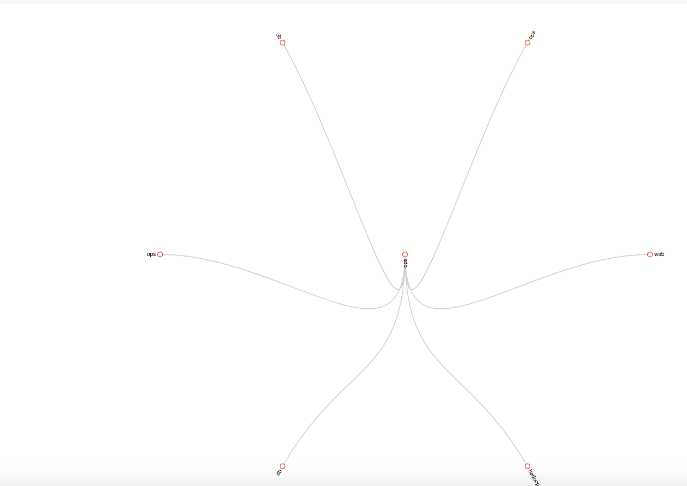
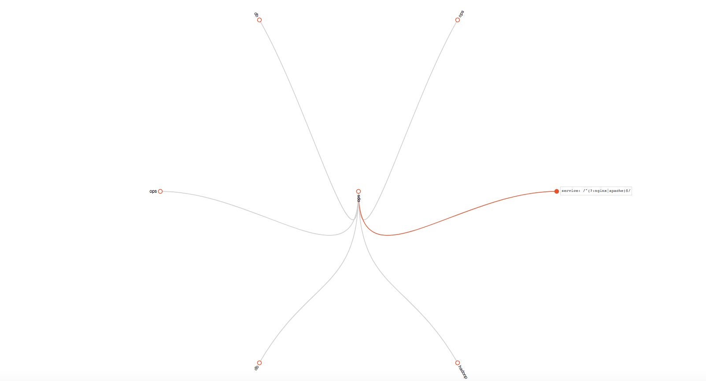
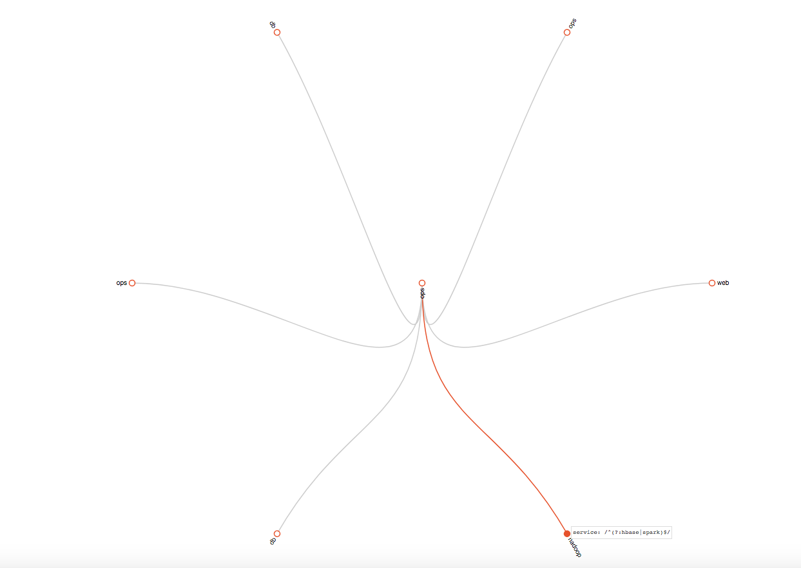

# 基于标签的告警路由

在Alertmanager的配置中会定义一个基于标签匹配规则的告警路由树，以确定在接收到告警后Alertmanager需要如何对其进行处理：

```
route: <route>
```

其中route中则主要定义了告警的路由匹配规则，以及Alertmanager需要将匹配到的告警发送给哪一个receiver，一个最简单的route定义如下所示：

```
route:
  group_by: ['alertname']
  receiver: 'web.hook'
receivers:
- name: 'web.hook'
  webhook_configs:
  - url: 'http://127.0.0.1:5001/'
```

如上所示：在Alertmanager配置文件中，我们只定义了一个路由，那就意味着所有由Prometheus产生的告警在发送到Alertmanager之后都会通过名为`web.hook`的receiver接收。这里的web.hook定义为一个webhook地址。当然实际场景下，告警处理可不是这么简单的一件事情，对于不同级别的告警，我们可能会不完全不同的处理方式，因此在route中，我们还可以定义更多的子Route，这些Route通过标签匹配告警的处理方式，route的完整定义如下：

```
[ receiver: <string> ]
[ group_by: '[' <labelname>, ... ']' ]
[ continue: <boolean> | default = false ]

match:
  [ <labelname>: <labelvalue>, ... ]

match_re:
  [ <labelname>: <regex>, ... ]

[ group_wait: <duration> | default = 30s ]
[ group_interval: <duration> | default = 5m ]
[ repeat_interval: <duration> | default = 4h ]

routes:
  [ - <route> ... ]
```

## 路由匹配

每一个告警都会从配置文件中顶级的route进入路由树，需要注意的是顶级的route必须匹配所有告警(即不能有任何的匹配设置match和match_re)，每一个路由都可以定义自己的接受人以及匹配规则。默认情况下，告警进入到顶级route后会遍历所有的子节点，直到找到最深的匹配route，并将告警发送到该route定义的receiver中。但如果route中设置**continue**的值为false，那么告警在匹配到第一个子节点之后就直接停止。如果**continue**为true，报警则会继续进行后续子节点的匹配。如果当前告警匹配不到任何的子节点，那该告警将会基于当前路由节点的接收器配置方式进行处理。

其中告警的匹配有两种方式可以选择。一种方式基于字符串验证，通过设置**match**规则判断当前告警中是否存在标签labelname并且其值等于labelvalue。第二种方式则基于正则表达式，通过设置**match_re**验证当前告警标签的值是否满足正则表达式的内容。

如果警报已经成功发送通知, 如果想设置发送告警通知之前要等待时间，则可以通过**repeat_interval**参数进行设置。

## 告警分组

在之前的部分有讲过，Alertmanager可以对告警通知进行分组，将多条告警合合并为一个通知。这里我们可以使用**group_by**来定义分组规则。基于告警中包含的标签，如果满足**group_by**中定义标签名称，那么这些告警将会合并为一个通知发送给接收器。

有的时候为了能够一次性收集和发送更多的相关信息时，可以通过**group_wait**参数设置等待时间，如果在等待时间内当前group接收到了新的告警，这些告警将会合并为一个通知向receiver发送。

而**group_interval**配置，则用于定义相同的Gourp之间发送告警通知的时间间隔。

例如，当使用Prometheus监控多个集群以及部署在集群中的应用和数据库服务，并且定义以下的告警处理路由规则来对集群中的异常进行通知。

```
route:
  receiver: 'default-receiver'
  group_wait: 30s
  group_interval: 5m
  repeat_interval: 4h
  group_by: [cluster, alertname]
  routes:
  - receiver: 'database-pager'
    group_wait: 10s
    match_re:
      service: mysql|cassandra
  - receiver: 'frontend-pager'
    group_by: [product, environment]
    match:
      team: frontend
```

默认情况下所有的告警都会发送给集群管理员default-receiver，因此在Alertmanager的配置文件的根路由中，对告警信息按照集群以及告警的名称对告警进行分组。

如果告警时来源于数据库服务如MySQL或者Cassandra，此时则需要将告警发送给相应的数据库管理员(database-pager)。这里定义了一个单独子路由，如果告警中包含service标签，并且service为MySQL或者Cassandra,则向database-pager发送告警通知，由于这里没有定义group_by等属性，这些属性的配置信息将从上级路由继承，database-pager将会接收到按cluser和alertname进行分组的告警通知。

而某些告警规则来源可能来源于开发团队的定义，这些告警中通过添加标签team来标示这些告警的创建者。在Alertmanager配置文件的告警路由下，定义单独子路由用于处理这一类的告警通知，如果匹配到告警中包含标签team，并且team的值为frontend，Alertmanager将会按照标签product和environment对告警进行分组。此时如果应用出现异常，开发团队就能清楚的知道哪一个环境(environment)中的哪一个应用程序出现了问题，可以快速对应用进行问题定位。

## 参数详解

路由匹配规则:

例子：
```yaml
route:
  receiver: admin # 默认的接收器名称
  group_wait: 30s # 在组内等待所配置的时间，如果同组内，30秒内出现相同报警，在一个组内出现。
  group_interval: 5m # 如果组内内容不变化，5m后发送。
  repeat_interval: 24h # 发送报警间隔，如果指定时间内没有修复，则重新发送报警
  group_by: [alertname,cluster]  # 报警分组，根据 prometheus 的 lables 进行报警分组，这些警报会合并为一个通知发送给接收器，也就是警报分组。
  routes:
      - match:
          team: ops
        group_by: [env,dc]
        receiver: 'ops'
      - match_re:
          service: nginx|apache
        receiver: 'web'
      - match_re:
          service: mysql|mongodb
        receiver: 'db'
      - match_re:
          service: hbase|spark
        receiver: 'hadoop'
```

在以上的例子中，默认的警报组全部发送给 admin ，且根据路由按照 alertname cluster 进行警报分组。在子路由中的若匹配警报中的标签 team 的值为 ops，Alertmanager 会按照标签 env dc 进行警报分组然后发送给接收器 receiver ops配置的警报通知源。 继续匹配的操作是对 service 标签进行匹配，并且配到了 nginx redis mongodb 的值，就会向接收器 receiver web配置的警报通知源发送警报信息。

对这种匹配验证操作很考察个人的逻辑思维能力，这不是人干的事情呀~因此，Prometheus发布了一个[Routing tree editor](https://www.prometheus.io/webtools/alerting/routing-tree-editor/)， 用于检测Alertmanager的配置文件结构配置信息，然后调试。使用方法很简单，就是把`alertmanager.yml`的配置信心复制到这个站点，然后点击`Draw Routing Tree`按钮生成路由结构树， 然后在`Match Label Set`前面输入以 {<label name> = "<value>"} 格式的警报标签，然后点击 Match Label Set 按钮会显示发送状态图。

以下是通过routing tree editor生成的树结构图.


然后我们可以使用 {service="nginx"} 和 {service="spark"} 表达式来做匹配的规则用于验证其发送通知源是否为 receiver 中db的发送配置。




