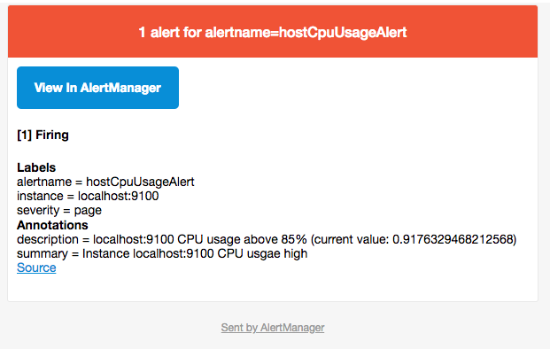

# 与SMTP邮件集成

邮箱应该是目前企业最常用的告警通知方式，Alertmanager内置了对SMTP协议的支持，因此对于企业用户而言，只需要一些基本的配置即可实现通过邮件的通知。

在Alertmanager使用邮箱通知，用户只需要定义好SMTP相关的配置，并且在receiver中定义接收方的邮件地址即可。在Alertmanager中我们可以直接在配置文件的global中定义全局的SMTP配置：

```
global:
  [ smtp_from: <tmpl_string> ]
  [ smtp_smarthost: <string> ]
  [ smtp_hello: <string> | default = "localhost" ]
  [ smtp_auth_username: <string> ]
  [ smtp_auth_password: <secret> ]
  [ smtp_auth_identity: <string> ]
  [ smtp_auth_secret: <secret> ]
  [ smtp_require_tls: <bool> | default = true ]
```

完成全局SMTP之后，我们只需要为receiver配置email_configs用于定义一组接收告警的邮箱地址即可，如下所示：

```
name: <string>
email_configs:
  [ - <email_config>, ... ]
```

每个email_config中定义相应的接收人邮箱地址，邮件通知模板等信息即可，当然如果当前接收人需要单独的SMTP配置，那直接在email_config中覆盖即可：

```
[ send_resolved: <boolean> | default = false ]
to: <tmpl_string>
[ html: <tmpl_string> | default = '{{ template "email.default.html" . }}' ]
[ headers: { <string>: <tmpl_string>, ... } ]
```

如果当前收件人需要接受告警恢复的通知的话，在email_config中定义`send_resolved`为true即可。

如果所有的邮件配置使用了相同的SMTP配置，则可以直接定义全局的SMTP配置。

这里，以Gmail邮箱为例，我们定义了一个全局的SMTP配置，并且通过route将所有告警信息发送到default-receiver中:

```
global:
  smtp_smarthost: smtp.gmail.com:587
  smtp_from: <smtp mail from>
  smtp_auth_username: <usernae>
  smtp_auth_identity: <username>
  smtp_auth_password: <password>

route:
  group_by: ['alertname']
  receiver: 'default-receiver'

receivers:
  - name: default-receiver
    email_configs:
      - to: <mail to address>
        send_resolved: true
```

> 需要注意的是新的Google账号安全规则需要使用”应用专有密码“作为邮箱登录密码

这时如果手动拉高主机CPU使用率，使得监控样本数据满足告警触发条件。在SMTP配置正确的情况下，可以接收到如下的告警内容：



配置案例
```yaml
global:
  resolve_timeout: 5m
  # smtp配置
  smtp_from: "user@163.com" # 发送邮件主题
  smtp_smarthost: 'smtp.163.com:25' # 邮箱服务器的SMTP主机配置
  smtp_auth_username: "user@163.com" # 登录用户名
  smtp_auth_password: "pass" # 此处的auth password是邮箱的第三方登录授权密码，而非用户密码。
  smtp_require_tls: false # 有些邮箱需要开启此配置，这里使用的是163邮箱，仅做测试，不需要开启此功能。
route:
  receiver: ops
  group_wait: 30s # 在组内等待所配置的时间，如果同组内，30秒内出现相同报警，在一个组内出现。
  group_interval: 5m # 如果组内内容不变化，合并为一条警报信息，5m后发送。
  repeat_interval: 24h # 发送报警间隔，如果指定时间内没有修复，则重新发送报警。
  group_by: [alertname]  # 报警分组
  routes:
      - match:
          team: operations
        group_by: [env,dc]
        receiver: 'ops'
      - receiver: ops # 路由和标签，根据match来指定发送目标，如果 rule的lable 包含 alertname， 使用 ops 来发送
        group_wait: 10s
        match:
          team: operations
# 接收器指定发送人以及发送渠道
receivers:
# ops分组的定义
- name: ops
  email_configs:
  - to: '9935226@qq.com,xxxxx@qq.com' # 如果想发送多个人就以 ','做分割，写多个邮件人即可。
    send_resolved: true
    headers:
      from: "警报中心"
      subject: "[operations] 报警邮件"
      to: "小煜狼皇"
```
