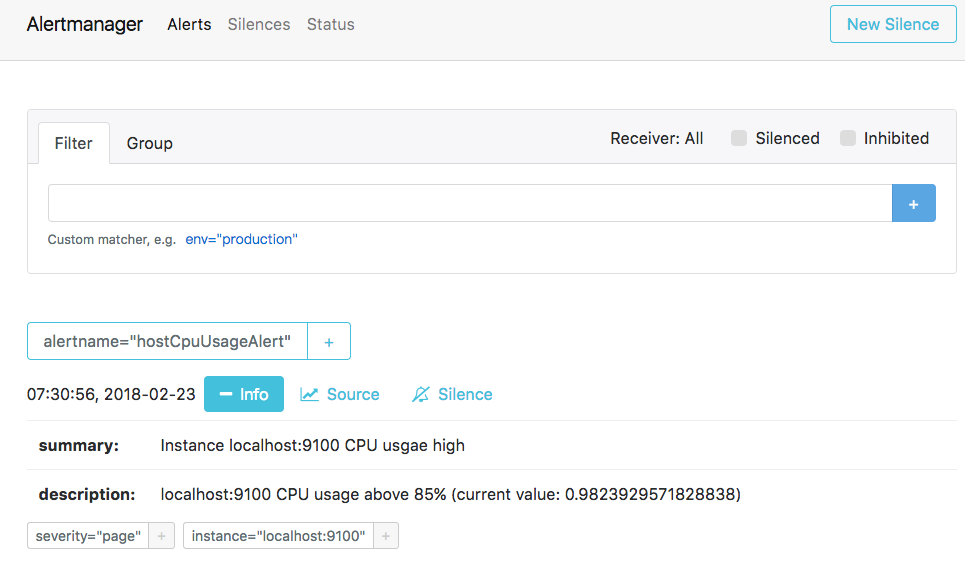

# 部署Alertmanager

Alertmanager和Prometheus Server一样均采用Golang实现，并且没有第三方依赖。一般来说我们可以通过以下几种方式来部署Alertmanager：二进制包、容器以及源码方式安装。

## 使用二进制包部署AlertManager

##### 获取并安装软件包

Alertmanager最新版本的下载地址可以从Prometheus官方网站[https://prometheus.io/download/](https://prometheus.io/download/)获取。

```shell
export VERSION=0.15.2
curl -LO https://github.com/prometheus/alertmanager/releases/download/v$VERSION/alertmanager-$VERSION.darwin-amd64.tar.gz
tar xvf alertmanager-$VERSION.darwin-amd64.tar.gz
```

##### 创建alertmanager配置文件

Alertmanager解压后会包含一个默认的alertmanager.yml配置文件，内容如下所示：

```
global:
  resolve_timeout: 5m

route:
  group_by: ['alertname']
  group_wait: 10s
  group_interval: 10s
  repeat_interval: 1h
  receiver: 'web.hook'
receivers:
- name: 'web.hook'
  webhook_configs:
  - url: 'http://127.0.0.1:5001/'
inhibit_rules:
  - source_match:
      severity: 'critical'
    target_match:
      severity: 'warning'
    equal: ['alertname', 'dev', 'instance']
```

Alertmanager的配置主要包含两个部分：路由(route)以及接收器(receivers)。所有的告警信息都会从配置中的顶级路由(route)进入路由树，根据路由规则将告警信息发送给相应的接收器。

在Alertmanager中可以定义一组接收器，比如可以按照角色(比如系统运维，数据库管理员)来划分多个接收器。接收器可以关联邮件，Slack以及其它方式接收告警信息。

当前配置文件中定义了一个默认的接收者default-receiver由于这里没有设置接收方式，目前只相当于一个占位符。关于接收器的详细介绍会在后续章节介绍。

在配置文件中使用route定义了顶级的路由，路由是一个基于标签匹配规则的树状结构。所有的告警信息从顶级路由开始，根据标签匹配规则进入到不同的子路由，并且根据子路由设置的接收器发送告警。目前配置文件中只设置了一个顶级路由route并且定义的接收器为default-receiver。因此，所有的告警都会发送给default-receiver。关于路由的详细内容会在后续进行详细介绍。

##### 启动Alertmanager

Alermanager会将数据保存到本地中，默认的存储路径为`data/`。因此，在启动Alertmanager之前需要创建相应的目录：

```
./alertmanager
```

用户也在启动Alertmanager时使用参数修改相关配置。`--config.file`用于指定alertmanager配置文件路径，`--storage.path`用于指定数据存储路径。

##### Alertmanager参数
 参数	| 描述 
 -|:-:|-:
--config.file="alertmanager.yml"	| 指定Alertmanager配置文件路径
--storage.path="data/"	| Alertmanager的数据存放目录
--data.retention=120h	|历史数据保留时间，默认为120h
--alerts.gc-interval=30m |	警报gc之间的间隔
--web.external-url=WEB.EXTERNAL-URL	| 外部可访问的Alertmanager的URL(例如Alertmanager是通过nginx反向代理)
--web.route-prefix=WEB.ROUTE-PREFIX	|web访问内部路由路径，默认是 --web.external-url
--web.listen-address=":9093"	|监听端口，可以随意修改
--web.get-concurrency=0|并发处理的最大GET请求数，默认为0
--web.timeout=0	|web请求超时时间
--cluster.listen-address="0.0.0.0:9094"	|集群的监听端口地址。设置为空字符串禁用HA模式
--cluster.advertise-address=CLUSTER.ADVERTISE-ADDRESS	|配置集群通知地址
--cluster.gossip-interval=200ms	|发送条消息之间的间隔，可以以增加带宽为代价更快地跨集群传播。
--cluster.peer-timeout=15s	|在同级之间等待发送通知的时间
...	|...
--log.level=info	|自定义消息格式 [debug, info, warn, error]
--log.format=logfmt	|日志消息的输出格式: [logfmt, json]
--version	|显示版本号

#### 查看运行状态

Alertmanager启动后可以通过9093端口访问，[http://192.168.33.10:9093](http://192.168.33.10:9093)


Alert菜单下可以查看Alertmanager接收到的告警内容。Silences菜单下则可以通过UI创建静默规则，这部分我们会在后续部分介绍。进入Status菜单，可以看到当前系统的运行状态以及配置信息。

## 关联Prometheus与Alertmanager

在Prometheus的架构中被划分成两个独立的部分。Prometheus负责产生告警，而Alertmanager负责告警产生后的后续处理。因此Alertmanager部署完成后，需要在Prometheus中设置Alertmanager相关的信息。

编辑Prometheus配置文件prometheus.yml,并添加以下内容

```
alerting:
  alertmanagers:
    - static_configs:
        targets: ['localhost:9093']
```

配置模板
```yaml
alerting:
  alert_relabel_configs:
    [ - <relabel_config> ... ]
  alertmanagers:
    [ - <alertmanager_config> ... ]
# alertmanagers 为 alertmanager_config 数组
```
配置范例：
```yaml
alerting:
  alert_relabel_configs: # 动态修改 alert 属性的规则配置。
    - source_labels: [dc] 
      regex: (.+)\d+
      target_label: dc1
  alertmanagers:
    - static_configs:
        - targets: ['127.0.0.1:9093'] # 单实例配置
        #- targets: ['172.31.10.167:19093','172.31.10.167:29093','172.31.10.167:39093'] # 集群配置
  - job_name: 'Alertmanager'
    # metrics_path defaults to '/metrics'
    # scheme defaults to 'http'.
    static_configs:
    - targets: ['localhost:19093']
```
上面的配置中的 alert_relabel_configs是指警报重新标记在发送到Alertmanager之前应用于警报。 它具有与目标重新标记相同的配置格式和操作，外部标签标记后应用警报重新标记，主要是针对集群配置。

这个设置的用途是确保具有不同外部label的HA对Prometheus服务端发送相同的警报信息。

Alertmanager 可以通过 static_configs 参数静态配置，也可以使用其中一种支持的服务发现机制动态发现，我们上面的配置是静态的单实例，针对集群HA配置，后面会讲。

此外，relabel_configs 允许从发现的实体中选择 Alertmanager，并对使用的API路径提供高级修改，该路径通过 __alerts_path__ 标签公开。

完成以上配置后，重启Prometheus服务，用以加载生效，也可以使用前文说过的热加载功能，使其配置生效。然后通过浏览器,就可以看 inactive pending firing 三个状态，没有警报信息是因为我们还没有配置警报规则 rules。


重启Prometheus服务，成功后，可以从[http://192.168.33.10:9090/config](http://192.168.33.10:9090/config)查看alerting配置是否生效。

此时，再次尝试手动拉高系统CPU使用率：

```
cat /dev/zero>/dev/null
```

等待Prometheus告警进行触发状态：


查看Alertmanager UI此时可以看到Alertmanager接收到的告警信息。




## 接下来

目前为止，我们已经成功安装部署了Alertmanager并且与Prometheus关联，能够正常接收来自Prometheus的告警信息。接下来我们将详细介绍Alertmanager是如何处理这些接收到的告警信息的。

