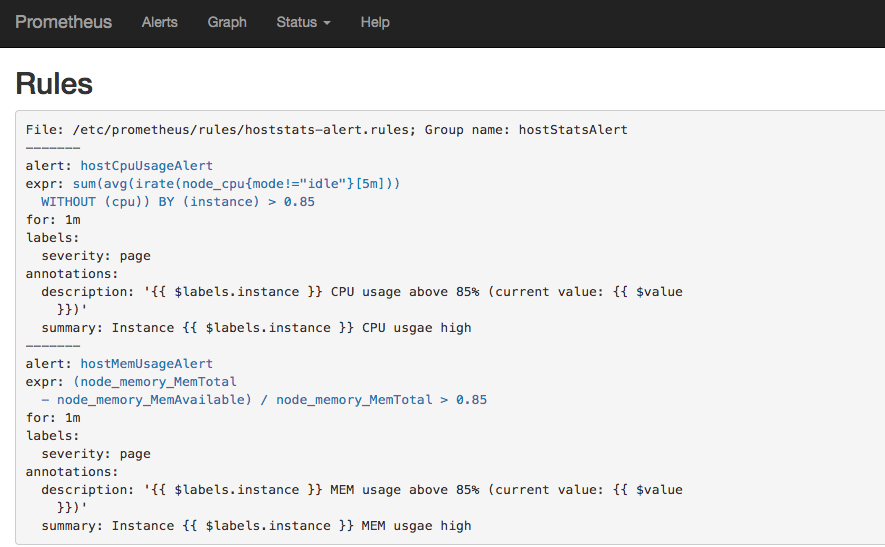
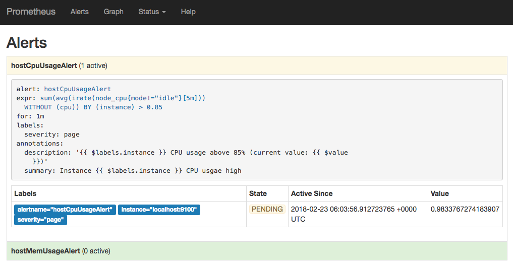
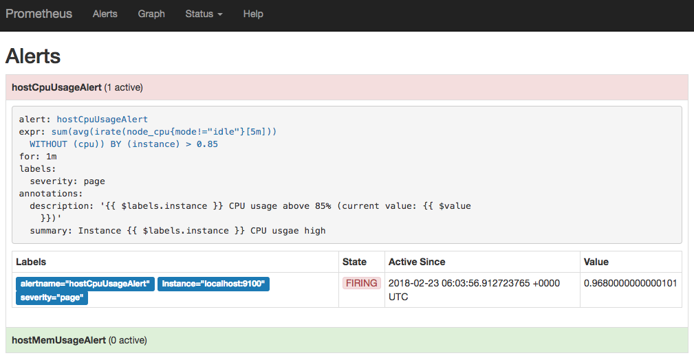

# 自定义Prometheus告警规则

Prometheus中的告警规则允许你基于PromQL表达式定义告警触发条件，Prometheus后端对这些触发规则进行周期性计算，当满足触发条件后则会触发告警通知。默认情况下，用户可以通过Prometheus的Web界面查看这些告警规则以及告警的触发状态。当Promthues与Alertmanager关联之后，可以将告警发送到外部服务如Alertmanager中并通过Alertmanager可以对这些告警进行进一步的处理。

## 定义告警规则

一条典型的告警规则如下所示：

```
groups:
- name: example
  rules:
  - alert: HighErrorRate
    expr: job:request_latency_seconds:mean5m{job="myjob"} > 0.5
    for: 10m
    labels:
      severity: page
    annotations:
      summary: High request latency
      description: description info
```

在告警规则文件中，我们可以将一组相关的规则设置定义在一个group下。在每一个group中我们可以定义多个告警规则(rule)。一条告警规则主要由以下几部分组成：

* alert：告警规则的名称。
* expr：基于PromQL表达式告警触发条件，用于计算是否有时间序列满足该条件。
* for：评估等待时间，可选参数。用于表示只有当触发条件持续一段时间后才发送告警。在等待期间新产生告警的状态为pending。
* labels：自定义标签，允许用户指定要附加到告警上的一组附加标签。
* annotations：用于指定一组附加信息，比如用于描述告警详细信息的文字等，annotations的内容在告警产生时会一同作为参数发送到Alertmanager。

为了能够让Prometheus能够启用定义的告警规则，我们需要在Prometheus全局配置文件中通过__rule_files__指定一组告警规则文件的访问路径，Prometheus启动后会自动扫描这些路径下规则文件中定义的内容，并且根据这些规则计算是否向外部发送通知：

```
rule_files:
  [ - <filepath_glob> ... ]
```
警报规则可以指定多个文件，也可以自定到自定义的目录下面，为了管理更为便捷，方便阅读，可以把警报规则拆成多分，用以区分环境，系统，服务等，如：prod，test，dev 等等，并且支持以正则表达式定义。

范例：
```yaml
rule_files:
    #- "/data/prometheus/rules/*.yml" # 正则表达式，会加在此目录下所有警报规则配置文件
    - "/data/prometheus/rules/ops.yml" # 仅加载ops.yml警报规则文件
    #- "/data/prometheus/rules/prod-*.yml" 
    #- "/data/prometheus/rules/test-*.yml"
    #- "/data/prometheus/rules/dev-*.yml"
```

默认情况下Prometheus会每分钟对这些告警规则进行计算，如果用户想定义自己的告警计算周期，则可以通过`evaluation_interval`来覆盖默认的计算周期：

```
global:
  [ evaluation_interval: <duration> | default = 1m ]
```

现在开始讲告警规则 Rules 的定义，格式为YAML。
```yaml
groups:
- name: <string>
  rules:
  - alert: <string>
    expr: <string>
    for:  [ <duration> | default 0 ]
    labels:
      [ <lable_name>: <label_value> ]
    annotations:
      [ <lable_name>: <tmpl_string> ]
```
参数|描述
 -|:-:|-:
- name: <string>	|警报规则组的名称
- alert: <string>	|警报规则的名称
expr: <string>	|使用PromQL表达式完成的警报触发条件，用于计算是否有满足触发条件
<lable_name>: <label_value>	|自定义标签，允许自行定义标签附加在警报上，比如high warning
annotations: <lable_name>: <tmpl_string>	|用来设置有关警报的一组描述信息，其中包括自定义的标签，以及expr计算后的值。

```yaml
groups:
- name: operations
  rules:
  - alert: node-down
    expr: up{env="operations"} != 1
    for: 5m
    labels:
      status: High
      team: operations
    annotations:
      description: "Environment: {{ $labels.env }} Instance: {{ $labels.instance }} is Down ! ! !"
      value: '{{ $value }}'
      summary:  "The host node was down 20 minutes ago"
```
以上就是一个完整`Rules`的配置，如果Prometheus 在周期检测中使用PromQ以`env=operations`为维度查询，如果当前查询结果中具有标签`operations`，且返回值都不等于1的时候，发送警报。 对于写好的`Rules`可以是常用 `promtool` 来检车ruls.yml的书写格式是否正确。
```bash
/usr/local/bin/promtool check rules /data/prometheus/rules/ops.yml
Checking /data/prometheus/rules/ops.yml
  SUCCESS: 7 rules found
```
对于修改好的rules文件，保存以后，经过检测没有问题，直接重新热加载 Prometheus就可以在页面看到了。对于触发警报规则，比较简单了，直接修改运算值或者去停掉 node-exporter 服务，便可在界面看到警报信息。一个告警在生命周期会有三种状态

状态|描述
 -|:-:|-:
Inactive	|正常状态，未激活警报
Pending	|已满足触发条件，但没有满足发送时间条件，此条件就是上面rules范例中的 for 5m 子句中定义的持续时间
Firing	|满足条件，且超过了 for 子句中的的指定持续时间5m

带有for子句的警报，当触发以后会先转换成Pending状态，然后在转换为Firing状态。这里需要俩个周期才能触发警报条件，**如果没有设置for子句，会直接从Inactive状态转换成Firing状态，直接触发警报**。

在运行过程中，Prometheus会把Pending或Firing状态的每一个告警创建一个 Alerts指标名称，这个可以通过Rules来触发警报测试，直接在UI中Graph查看指标 ALERTS，格式如下：
```
ALERTS{alertname="alert name",alertstate="pending|firing",<additional alert label>}
```


当警报处于激活状态 Pending 或者 Firing时候，如上图所示，样本值为1。其他状态为0。则不显示。上图已经触发警报，其警报已经被转发给Alertmanager组件，此时可以在浏览器上通过可以用过9093端口访问，查看警报状态。


现在我们来说一下整理下Prometheus从收集监控指标信息到触发警报的过程
状态	|描述
-|:-:|-:
1.定义规则	|在Prometheus配置中，scrape_interval: 15s，默认是1分钟，这个定义是收集监控指标信息的采集周期，同时配置对应的警报规则，可以是全局，也可以单独为某一个metrics定义
2.周期计算	|对于表达式进行计算时，Prometheus中的配置中配置了 evaluation_interval: 15s，默认也是一分钟，为警报规则的计算周期，evaluation_interval 只是全局计算周期值。
3.1警报状态转换(pending)	|当首次触发警报规则条件成立，表达式为 true，并且没有满足警报规则中的for子句中的持续时间时，警报状态切换为 Pending
3.2警报状态转换(firing)	|若下一个计算周期中，表达式仍为 true，并且满足警报规则中的for子句的持续时间时，警报状态转换为 Firing，即为 active，警报会被Prometheus推送到ALertmanager组件
3.3警报状态转换(period)	|如果在 evaluation_interval 的计算周期内，表达式还是为 true，同时满足 for子句的持续时间，持续转发到Alertmanager，这里只是转发状态到Alertmanager，并不是直接发送通知到指定通知源
3.4警报状态转换(resolve)	|只到某个周期，表达式 为 false，警报状态会变成 inactive ，并且会有一个 resolve被发送到Alertmanager，用于说明警报故障依解决，发送resolve信息需要自己单独在Alertmanager中定义

## 模板化

一般来说，在告警规则文件的annotations中使用`summary`描述告警的概要信息，`description`用于描述告警的详细信息。同时Alertmanager的UI也会根据这两个标签值，显示告警信息。为了让告警信息具有更好的可读性，Prometheus支持模板化label和annotations的中标签的值。

- {{ $labels.<labelname> }}变量可以访问当前告警实例中指定标签的值。
- {{ $value }}则可以获取当前PromQL表达式计算的样本值。

```yaml
# To insert a firing element's label values:
{{ $labels.<labelname> }}
# To insert the numeric expression value of the firing element:
{{ $value }}
```

例如，可以通过模板化优化summary以及description的内容的可读性：

```yaml
groups:
- name: example
  rules:

  # Alert for any instance that is unreachable for >5 minutes.
  - alert: InstanceDown
    expr: up == 0
    for: 5m
    labels:
      severity: page
    annotations:
      summary: "Instance {{ $labels.instance }} down"
      description: "{{ $labels.instance }} of job {{ $labels.job }} has been down for more than 5 minutes."

  # Alert for any instance that has a median request latency >1s.
  - alert: APIHighRequestLatency
    expr: api_http_request_latencies_second{quantile="0.5"} > 1
    for: 10m
    annotations:
      summary: "High request latency on {{ $labels.instance }}"
      description: "{{ $labels.instance }} has a median request latency above 1s (current value: {{ $value }}s)"
```

## 查看告警状态

如下所示，用户可以通过Prometheus WEB界面中的Alerts菜单查看当前Prometheus下的所有告警规则，以及其当前所处的活动状态。


同时对于已经pending或者firing的告警，Prometheus也会将它们存储到时间序列ALERTS{}中。

可以通过表达式，查询告警实例：

```
ALERTS{alertname="<alert name>", alertstate="pending|firing", <additional alert labels>}
```

样本值为1表示当前告警处于活动状态（pending或者firing），当告警从活动状态转换为非活动状态时，样本值则为0。

## 实例：定义主机监控告警

修改Prometheus配置文件prometheus.yml,添加以下配置：

```
rule_files:
  - /etc/prometheus/rules/*.rules
```


在目录/etc/prometheus/rules/下创建告警文件hoststats-alert.rules内容如下：

```
groups:
- name: hostStatsAlert
  rules:
  - alert: hostCpuUsageAlert
    expr: sum(avg without (cpu)(irate(node_cpu{mode!='idle'}[5m]))) by (instance) > 0.85
    for: 1m
    labels:
      severity: page
    annotations:
      summary: "Instance {{ $labels.instance }} CPU usgae high"
      description: "{{ $labels.instance }} CPU usage above 85% (current value: {{ $value }})"
  - alert: hostMemUsageAlert
    expr: (node_memory_MemTotal - node_memory_MemAvailable)/node_memory_MemTotal > 0.85
    for: 1m
    labels:
      severity: page
    annotations:
      summary: "Instance {{ $labels.instance }} MEM usgae high"
      description: "{{ $labels.instance }} MEM usage above 85% (current value: {{ $value }})"
```

重启Prometheus后访问Prometheus UI[http://127.0.0.1:9090/rules](http://127.0.0.1:9090/rules)可以查看当前以加载的规则文件。



切换到Alerts标签[http://127.0.0.1:9090/alerts](http://127.0.0.1:9090/alerts)可以查看当前告警的活动状态。


此时，我们可以手动拉高系统的CPU使用率，验证Prometheus的告警流程，在主机上运行以下命令：

```
cat /dev/zero>/dev/null
```

运行命令后查看CPU使用率情况，如下图所示：


Prometheus首次检测到满足触发条件后，hostCpuUsageAlert显示由一条告警处于活动状态。由于告警规则中设置了1m的等待时间，当前告警状态为PENDING，如下图所示：



如果1分钟后告警条件持续满足，则会实际触发告警并且告警状态为FIRING，如下图所示：



## 接下来

在这一小节中介绍了如何配置和使用Prometheus提供的告警能力，并且尝试实现了对主机CPU以及内存的告警规则设置。目前为止，我们只能通过Prometheus UI查看当前告警的活动状态。接下来，接下来我们将尝试利用Prometheus体系中的另一个组件Alertmanager对这些触发的告警进行处理，实现告警通知。

## 小结
需要注意的是，一个稳定的Prometheus监控系统中，要尽量使用模板化，这样会降低性能开销（Debug调试信息等），同时也易于维护。

下面网站收录了当前大部分的rules规则，大家可以对应自己的环境，配置相关服务的Rules。

[Prometheus告警规则收集](https://awesome-prometheus-alerts.grep.to/)