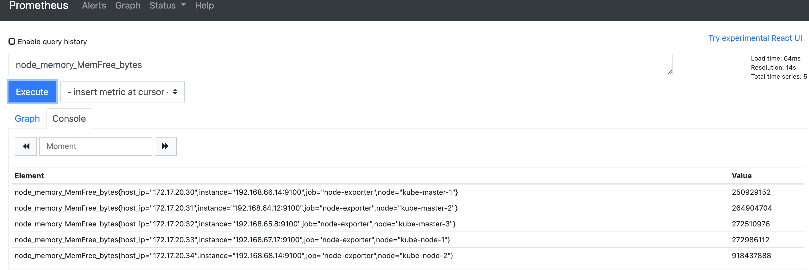
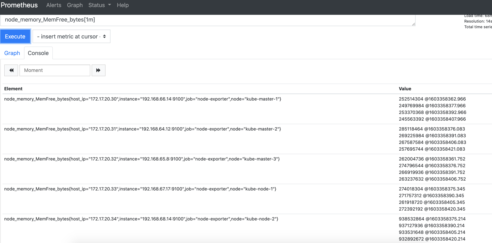

# 理解时间序列

在1.2节当中，通过Node Exporter暴露的HTTP服务，Prometheus可以采集到当前主机所有监控指标的样本数据。例如：

```
# HELP node_cpu Seconds the cpus spent in each mode.
# TYPE node_cpu counter
node_cpu{cpu="cpu0",mode="idle"} 362812.7890625
# HELP node_load1 1m load average.
# TYPE node_load1 gauge
node_load1 3.0703125
```

其中非#开头的每一行表示当前Node Exporter采集到的一个监控样本：node_cpu和node_load1表明了当前指标的名称、大括号中的标签则反映了当前样本的一些特征和维度、浮点数则是该监控样本的具体值。

## 样本

Prometheus会将所有采集到的样本数据以时间序列（time-series）的方式保存在内存数据库中，并且定时保存到硬盘上。time-series是按照时间戳和值的序列顺序存放的，我们称之为向量(vector). 每条time-series通过指标名称(metrics name)和一组标签集(labelset)命名。如下所示，可以将time-series理解为一个以时间为Y轴的数字矩阵：

```
  ^
  │   . . . . . . . . . . . . . . . . .   . .   node_cpu{cpu="cpu0",mode="idle"}
  │     . . . . . . . . . . . . . . . . . . .   node_cpu{cpu="cpu0",mode="system"}
  │     . . . . . . . . . .   . . . . . . . .   node_load1{}
  │     . . . . . . . . . . . . . . . .   . .  
  v
    <------------------ 时间 ---------------->
```

在time-series中的每一个点称为一个样本（sample），样本由以下三部分组成：

* 指标(metric)：metric name和描述当前样本特征的labelsets;
* 时间戳(timestamp)：一个精确到毫秒的时间戳;
* 样本值(value)： 一个folat64的浮点型数据表示当前样本的值。

```
<--------------- metric ---------------------><-timestamp -><-value->
http_request_total{status="200", method="GET"}@1434417560938 => 94355
http_request_total{status="200", method="GET"}@1434417561287 => 94334

http_request_total{status="404", method="GET"}@1434417560938 => 38473
http_request_total{status="404", method="GET"}@1434417561287 => 38544

http_request_total{status="200", method="POST"}@1434417560938 => 4748
http_request_total{status="200", method="POST"}@1434417561287 => 4785
```

## 指标(Metric)

在形式上，所有的指标(Metric)都通过如下格式标示：

```
<metric name>{<label name>=<label value>, ...}
```

指标的名称(metric name)可以反映被监控样本的含义（比如，`http_request_total` - 表示当前系统接收到的HTTP请求总量）。指标名称只能由ASCII字符、数字、下划线以及冒号组成并必须符合正则表达式```[a-zA-Z_:][a-zA-Z0-9_:]*```。

标签(label)反映了当前样本的特征维度，通过这些维度Prometheus可以对样本数据进行过滤，聚合等。标签的名称只能由ASCII字符、数字以及下划线组成并满足正则表达式```[a-zA-Z_][a-zA-Z0-9_]*```。

其中以`__`作为前缀的标签，是系统保留的关键字，只能在系统内部使用。标签的值则可以包含任何Unicode编码的字符。在Prometheus的底层实现中指标名称实际上是以`__name__=<metric name>`的形式保存在数据库中的，因此以下两种方式均表示的同一条time-series：

```
api_http_requests_total{method="POST", handler="/messages"}
```

等同于：

```
{__name__="api_http_requests_total"，method="POST", handler="/messages"}
```

在Prometheus源码中也可以指标(Metric)对应的数据结构，如下所示：

```
type Metric LabelSet

type LabelSet map[LabelName]LabelValue

type LabelName string

type LabelValue string
```


## 数据类型
- 瞬时向量（Instant vector）
- 区间向量（Range vector）
- 标量数据 (Scalar): 一个浮点数
- 字符串 (String): 一个字符串，暂时未用
### 瞬时向量
比如我们在Prometheus的查询页面输入的一个指标node_memory_MemFree_bytes进行查询，会返回五行数据：

这五行就是五个时序，但是注意到这个五个时序数据每一个都是只有一个时刻的值。*瞬时向量（Instant vector）*类型数据是指有多个时序序列，但是每一个时序序列`只有一个时刻`的值，这种类型的数据称为*瞬时向量（Instant vector）*。

### 区间向量
比如我们在Prometheus的查询页面输入的一个一个查询语句node_memory_MemFree_bytes[1m]进行查询,会返回五行数据也就是五行时序序列，因为采集周期是15s,所以每一个时序会有4个数据，*区间向量（Range vector）*类型数据是指有个时序，每一个时序有个一个时间区间的数据，这种类型的数据成为*区间向量（Range vector）*。


瞬时向量对应的是某个时间点的纵轴切面，区间向量对应的就是某个时间段的纵轴切块。

这个概念很重要，举例：1点CPU使用率10%，2点CPU使用率20%，3点CPU使用率30%

那么瞬时向量就是1点CPU使用率10%，这个采集点的所有样本数据，区间向量就是三个小时的所有样本数据。区别就是一个代表一个采集点，一个代表某个时间段的几个采集点。


