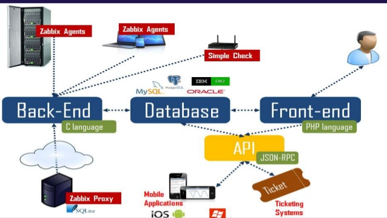
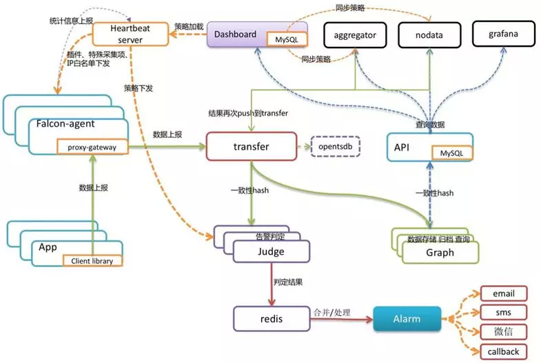
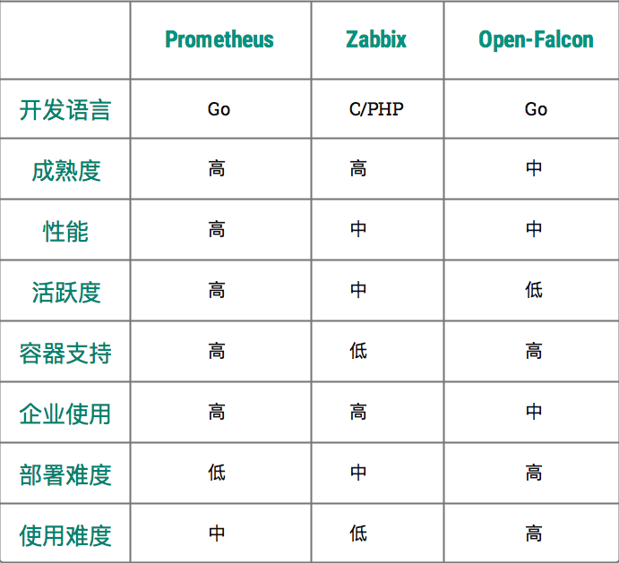

# 开源监控对比
## 选型
为了让大家更好的、直观的、有建设性的认识到当前开源监控系统的发展趋势，这里使用当前比较流行的，人气比较高的，三个开源监控软件：Prometheus、Zabbix、Open-Falcon

本次的对比内容，主要从监控维度、数据存储、可视化、告警四个方向出发，另外，对于优劣势，没有完整的定义，因场景不同，监控设计也必然不同，只有适合自己的架构才是最合适的方案。

### Zabbix
Zabbix 是由 Alexei Vladishev 创建，目前由 Zabbix SIA 在持续开发和支持，同时 Zabbix 是一个企业级的分布式开源监控方案，支持多种采集方式和采集客户端， 同时支持 SNMP、IPMI、JMX、Telnet、SSH等多种协议，它将采集到的数据存放到MySQL数据库中，然后对数据指标其进行分析整理，如果符合设置的告警阈值规则，则触发相应的告警通知。

Zabbix 核心组件主要是 Agent 、Server，其中 Agent 主要负责数据采集并通过被动 or 主动的方式把采集到数据推送到 Server，如果对于一些网络隔离的环境可能需要推送数据到 Proxy， 除此之外，为了扩展监控指标，Agent 还支持自定义脚本。Server 主要负责接收 Agent 发送的监控指标信息，并进行数据汇总存储以及设置的阈值触发告警。

Zabbix Server 将收集的监控数据存储到 Zabbix Database (MySQL)中，此处的数据存储可以根据场景自行定义，Zabbix Database 支持常用的关系型数据库: MySQL、PostgreSQL、Oracle 等， 默认是 MySQL，并提供Web（PHP 编写）管理、数据查询、警报配置等。

Zabbix 因为使用了关系型数据存储时序数据，所以在监控大规模集群实例时常常在数据存储以及查询能力略现在足。为了解决这一问题，Zabbix 从 4.2 版本后开始支持 TimescaleDB 时序数据库，不过目前成熟度与关注度并不高。

### Open-Falcon

Open-Falcon 是小米开源的企业级监控工具，用 Go 语言开发而成，包括小米、滴滴、美团等在内的互联网公司都在使用它，是一款灵活、可扩展并且高性能的监控方案，主要组件包括了：

1). Falcon-agent 是用 Go 语言开发的 Daemon 程序，运行在每台 Linux 服务器上，用于采集主机上的各种指标数据，主要包括 CPU、内存、磁盘、文件系统、内核参数、Socket 连接等，目前已经支持 200 多项监控指标。并且，Agent 支持用户自定义的监控脚本。

2). Hearthbeat server 简称 HBS 心跳服务，每个 Agent 都会周期性地通过 RPC 方式将自己的状态上报给 HBS，主要包括主机名、主机 IP、Agent 版本和插件版本，Agent 还会从 HBS 获取自己需要执行的采集任务和自定义插件。

3). Transfer 负责接收 Agent 发送的监控数据，并对数据进行整理，在过滤后通过一致性 Hash 算法发送到 Judge 或者 Graph。

4). Graph 是基于 RRD 的数据上报、归档、存储组件。Graph 在收到数据以后，会以 rrdtool 的数据归档方式来存储，同时提供 RPC 方式的监控查询接口。

5). Judge 告警模块，Transfer 转发到 Judge 的数据会触发用户设定的告警规则，如果满足，则会触发邮件、微信或者回调接口。这里为了避免重复告警引入了 Redis 暂存告警，从而完成告警的合并和抑制。

6). Dashboard 是面向用户的监控数据查询和告警配置界面。

### Prometheus

Prometheus 是由 SoundCloud 开发的开源监控系统，存储默认使用的是TSDB。Prometheus 的基本原理是通过 HTTP 周期性抓取被监控组件的指标信息存储到Prometheus的存储TSDB中， 任意组件只要提供对应的 HTTP 接口并且符合 Prometheus 定义的数据存储格式，就可以接入 Prometheus 进行监控、指标信息收集。

Prometheus 服务端 负责定时在目标上抓取 Metrics 数据并保存到本地存储TSDB里面，此外，Prometheus 也支持第三方数据持久化存储配置，如：Chanos、Influxdb、ElasticSearch等。

Prometheus 服务端 采用了一种 Pull 模式获取数据，可以降低客户端的复杂度，客户端只负责数据采集，不需要感知服务端情况，服务端更好的方便水平扩展。

针对监控告警，只要监控数据指标符合预设的告警阈值， Prometheus 服务端 会通过 HTTP 将告警发送到 Alertmanger 组件 ，通过告警配置好的抑制、分组后触发告警信息并发送到指定的告警发送配置，支持多种告警配置：邮件、Webhook「Dingtalk、Wechat」等。

Prometheus 支持 在 WEB 页面使用 PromQL 多维度数据指标的集合运算查询，通过监控指标关联多个 Label 的方式，将监控数据进行任意维度的组合以及聚合查询并展示指标返回值。

## 对比结果

- **开发语言:** 综合上面图对比，从开发语言上讲，为了应对开发难度和快速迭代的需求，许多监控系统的开发语言已经慢慢从其他语言转移到 Go，如Zabbix，已经逐渐的讲后端语言转向Go；Prometheus与Open-Falcon更不必言说，原生就是go语言开发； 由此看见，Go 凭借简洁的语法和优雅的高并发优势，在Java占据业务开发，C占领底层开发的情况下，仍可以在当前开源中间件领域得到广泛应用，并且得到了大部分多企业的认可，开始逐渐将一些核心业务的语言转向了Go领域，这是非常好的事情；

- **成熟度:** 从成熟度来看，Zabbix 和 Nagios 都是老牌的监控系统，系统功能比较完善、稳定，同时对于市场的占有率一直属于中上流。 虽然Prometheus与Open-Falcon出现的比较晚，但Prometheus是CNCF的第二个毕业项目，很多企业都在试用，社区也很活跃，口碑也很好，功能迭代速度也比较快；

- **性能:** 对于数据存储方面的新能，Zabbix因为使用关系型数据库的原因，导致其性能在大规模集群下的采集、存储会存在性能瓶颈，解决起来需要重新针对架构调整以及数据库优化；Open-Falcon使用了RDD数据存储，还使用了一致性 Hash算法分片数据，并且对接了OpenTSDB，相比Zabbix要好很多； 而Prometheus 自带默认的TSDB在V3版本就可以每秒达到了千万级别的数据存储，同时可以通过对接第三方时序数据库扩展历史数据的数据持久化存储；

- **部署难度:** 从部署配置角度上看，Prometheus 只有一个核心 Server 组件，一条命令便可以启动，并且随着社区的活跃度增加，部署文档已经相当完善；相比Open-Falcon而言，因为活跃度的问题，在安装、系统配置会比Prometheus难度略高；对于Zabbix，因为其历史原因，文档极多，方案林立，在部署配置中不会遇到太大问题。

- **使用难度:** 对于Prometheus的架构理解并不难，主要是需要把各个组件逻辑关系融会贯通的理解清楚，前期需要对一些知识要有一定的垫铺，否则在排查上会遇到一些困惑；Zabbix，相对来说要好一些，毕竟是老牌的监控，文档比较成熟，并且使用者有商业支持；至于Open-Falcon，因其使用范围的局限性，并且文档与社区并不活跃，会导致使用难度成本较高。

- **容器支持:** 对于容器支持，不得不提云原生，由于 Zabbix 和 Nagios 出现得比较早，当时云原生的概念还没有诞生，想立马对云原生的支持是需要时间的。Open-Falcon 虽然提供了容器的监控，但支持力度有限，社区的不活跃导致了其迭代的能力问题。作为云原生第二个项目Prometheus，其动态发现机制，不仅可以支持 swarm 原生集群，还支持 Kubernetes 集群的监控，是目前容器监控最好解决方案。 至于Zabbix 在传统监控系统中，尤其是在服务器相关监控方面，一直占据绝对优势，但是因为Prometheus的迭代与活跃度，传统监控的功能也在社区逐渐完善。

- **活跃度:** 从社区活跃度上看，目前 Zabbix 和 Nagios 的社区活跃度比较低，尤其是 Nagios，Open-Falcon 虽然也比较活跃，但基本都是国内的公司参与，Prometheus 作为第二个加入CNCF的项目，在这方面占据绝对优势，社区活跃度一直很高，并且受到 CNCF 的支持，后期的发展前景一目了然；

- **企业使用:** 因为云原生的概念，各大云商逐渐开放对Kubernetes的的集成服务，作为原生监控Prometheus的使用率，一直持几何倍数递增；相对Open-Falcon，除却一些历史因素，一直在使用，已经逐渐淹没在历史的潮流中； Zabbix，作为传统应用监控，并且有商业支持，在传统监控应用范围，一直利于不败之地，尽管Zabbix已经开始用go语言作为后端开发语言，并且把Kubernetes的集群支持提上了征程，对于功能的可靠性、稳定性等等，是否晚上，可能还需要一定时日才能得以验证；

对比以上各种监控系统，可以看出，Prometheus 是当之无愧的 云原生监控神器，没有之一。

当然，有人肯定会问，Prometheus 能不能作为传统监控使用呢？答案是，可以，但是不建议，如果是传统应用监控，zabbix 会更为适合；

因为这跟 Prometheus 最初的设计理念有关，Prometheus 是作为云原生而生的监控系统，在设计上的理念是为了微服务而生，同时它的 k/v 数据模型设计，他采集的数据是基于时序的 float64 的值，如果你的数据值有更多类型，想满足需求需要做大量的工作；

不过，因为 Prometheus 的迅速发展以及开源社区活跃度极高的原因，开源贡献者针对Prometheus在传统应用监控的需求，开发出了很多可以满足当前传统应用监控的一些 exporter，方便一些对数据类型要求不高的使用者；