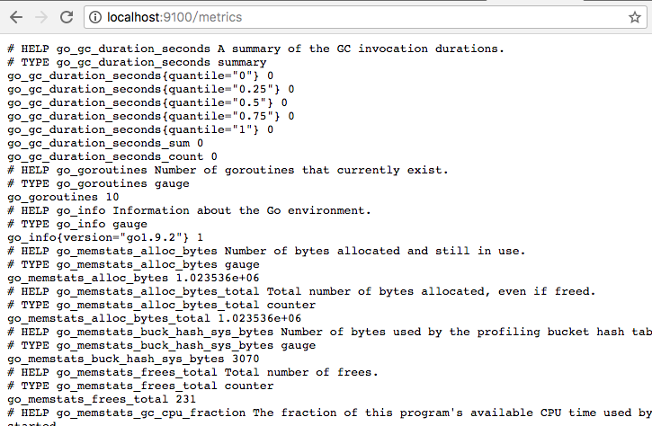

# 使用Node Exporter采集主机运行数据

## 安装Node Exporter

在Prometheus的架构设计中，Prometheus Server并不直接服务监控特定的目标，其主要任务负责数据的收集，存储并且对外提供数据查询支持。因此为了能够能够监控到某些东西，如主机的CPU使用率，我们需要使用到Exporter。Prometheus周期性的从Exporter暴露的HTTP服务地址（通常是/metrics）拉取监控样本数据。

从上面的描述中可以看出Exporter可以是一个相对开放的概念，其可以是一个独立运行的程序独立于监控目标以外，也可以是直接内置在监控目标中。只要能够向Prometheus提供标准格式的监控样本数据即可。

这里为了能够采集到主机的运行指标如CPU, 内存，磁盘等信息。我们可以使用[Node Exporter](https://github.com/prometheus/node_exporter)。

Node Exporter同样采用Golang编写，并且不存在任何的第三方依赖，只需要下载，解压即可运行。可以从[https://prometheus.io/download/](https://prometheus.io/download/)获取最新的node exporter版本的二进制包。

```
curl -OL https://github.com/prometheus/node_exporter/releases/download/v0.15.2/node_exporter-0.15.2.darwin-amd64.tar.gz
tar -xzf node_exporter-0.15.2.darwin-amd64.tar.gz
```

运行node exporter:

```
cd node_exporter-0.15.2.darwin-amd64
cp node_exporter-0.15.2.darwin-amd64/node_exporter /usr/local/bin/
node_exporter
```

启动成功后，可以看到以下输出：

```
INFO[0000] Listening on :9100                            source="node_exporter.go:76"
```

访问[http://localhost:9100/](http://localhost:9100/)可以看到以下页面：


### 初始Node Exporter监控指标

访问[http://localhost:9100/metrics](http://localhost:9100/metrics)，可以看到当前node exporter获取到的当前主机的所有监控数据，如下所示：



每一个监控指标之前都会有一段类似于如下形式的信息：

```
# HELP node_cpu Seconds the cpus spent in each mode.
# TYPE node_cpu counter
node_cpu{cpu="cpu0",mode="idle"} 362812.7890625
# HELP node_load1 1m load average.
# TYPE node_load1 gauge
node_load1 3.0703125
```

其中HELP用于解释当前指标的含义，TYPE则说明当前指标的数据类型。在上面的例子中node_cpu的注释表明当前指标是cpu0上idle进程占用CPU的总时间，CPU占用时间是一个只增不减的度量指标，从类型中也可以看出node_cpu的数据类型是计数器(counter)，与该指标的实际含义一致。又例如node_load1该指标反映了当前主机在最近一分钟以内的负载情况，系统的负载情况会随系统资源的使用而变化，因此node_load1反映的是当前状态，数据可能增加也可能减少，从注释中可以看出当前指标类型为仪表盘(gauge)，与指标反映的实际含义一致。

除了这些以外，在当前页面中根据物理主机系统的不同，你还可能看到如下监控指标：

* node_boot_time：系统启动时间
* node_cpu：系统CPU使用量
* node_disk_*：磁盘IO
* node_filesystem_*：文件系统用量
* node_load1：系统负载
* node_memeory_*：内存使用量
* node_network_*：网络带宽
* node_time：当前系统时间
* go_*：node exporter中go相关指标
* process_*：node exporter自身进程相关运行指标

## 从Node Exporter收集监控数据

为了能够让Prometheus Server能够从当前node exporter获取到监控数据，这里需要修改Prometheus配置文件。编辑prometheus.yml并在scrape_configs节点下添加以下内容:

```
scrape_configs:
  - job_name: 'prometheus'
    static_configs:
      - targets: ['localhost:9090']
  # 采集node exporter监控数据
  - job_name: 'node'
    static_configs:
      - targets: ['localhost:9100']
```

重新启动Prometheus Server

访问[http://localhost:9090](http://localhost:9090)，进入到Prometheus Server。如果输入“up”并且点击执行按钮以后，可以看到如下结果：


如果Prometheus能够正常从node exporter获取数据，则会看到以下结果：

```
up{instance="localhost:9090",job="prometheus"}	1
up{instance="localhost:9100",job="node"}	1
```

其中“1”表示正常，反之“0”则为异常。